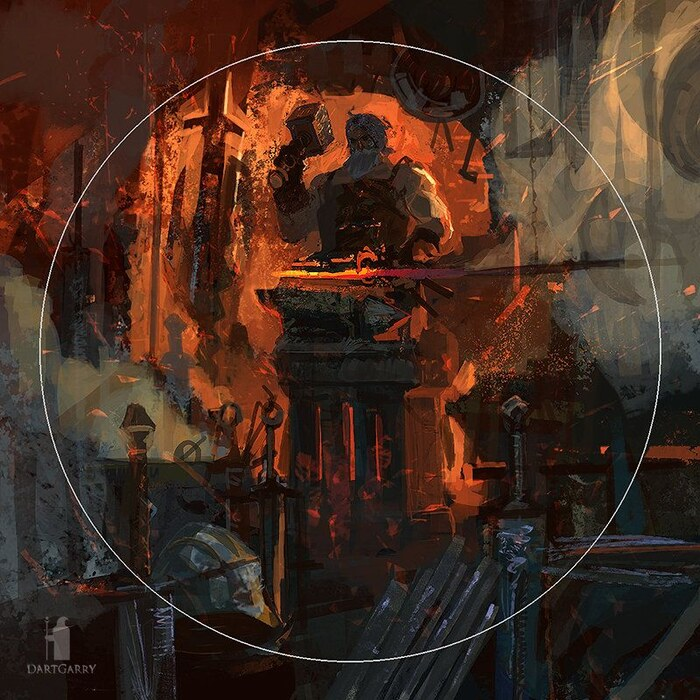

<p align="center">
  
</p>

<h1 align="center">Blacksmith</h1>

Blacksmith is an opinionated suite of Claude Code plugins for fast, accurate
agentic development. It encodes one way of working: small commands, plain
files, and a human gate on anything that becomes long-term knowledge.

Blacksmith is a Claude Code **plugin marketplace** with two plugins,
anvil and forge. Install both, or only one.

> **Version 0.0.5**: anvil 0.0.5 and forge 0.0.3. 0.0.3 was the first
> public release. Version 0.0.1 was checked by hand command by command on
> 2026-09-24. Builds between releases add `_N` (for example `0.0.2_1`).

## Plugins

| Plugin | Job | Details |
|---|---|---|
| [anvil](anvil/README.md) | Long-term memory. A shared markdown vault of atomic notes that Claude searches on demand and writes to only with your approval; plus handoffs and a journal. | [anvil/README.md](anvil/README.md) |
| [forge](forge/README.md) | Working conventions inside any repo: writeups, todo tracking, context cards, and credential setup. | [forge/README.md](forge/README.md) |

Each plugin works alone. When both are installed, forge offers an anvil
note that links to a new writeup.

## Commands at a glance

**Trigger:** **You** means the skill is user-only (`disable-model-invocation`):
Claude cannot run it, and its description costs no context. **Claude** means
Claude starts it on its own when its description matches the moment.

| Command | Trigger | Does |
|---|---|---|
| `/anvil:recall [--full] <topic>` | You or Claude | Finds approved notes and reports what they say |
| `/anvil:note <claim>` | You or Claude | Drafts a note; asked by you, it goes straight to review |
| `/anvil:reflect [focus]` | You | Drafts notes from this session |
| `/anvil:ingest <url\|path>` | You | Keeps a clean copy of a page or PDF; you pick the claims |
| `/anvil:hydrate` | You | Drafts notes from past sessions (last 30 days) |
| `/anvil:inbox` | You | Reviews waiting drafts |
| `/anvil:handoff [focus]` | You | Records where a project stands |
| `/anvil:journal [topic]` | You | Records a thinking session with no project yet |
| `/anvil:world [project \| journal [word]]` | You | Shows handoffs and the journal |
| `/anvil:backfill [field]` | You | Fills empty note fields, a batch at a time |
| `/anvil:vault` | You | Vault status |
| `/forge:card` | Claude | Keeps short, checksummed summaries of large files |
| `/forge:todo [list\|add\|done\|drop]` | You or Claude | Work items in `todo.md` / `done.md`; Claude on its own only adds blockers |
| `/forge:writeup <topic>` | You | A long-form writeup of a hard-won lesson |
| `/forge:env <component> <KEY>` | You | Sets up a credential the safe way |

Plugin commands always carry the plugin name (`/anvil:…`, `/forge:…`).

To read handoffs with no model cost, type `! anvil world [<project>]` in
the prompt. `/anvil:world` shows the same output and adds one line on the
next step, but it takes a model turn.

## Three memory layers

| Layer | What | Written by | Reached by |
|---|---|---|---|
| Short-term | The context window | Automatically | Being in the session |
| Long-term | anvil notes (~100 tokens each), plus handoffs and journal entries | Drafts you approve in the Anvil Review question | `/anvil:recall`, `/anvil:world` |
| Deep | forge writeups in a repo's `.blacksmith/forge/writeups/` | You only, with `/forge:writeup` | Following a note's link, read-only (`anvil source`) |

Nothing is loaded into a session automatically. The agent goes only as deep
as the task needs.

## Principles

- **No preload.** Knowledge loads when asked for, never at session start.
- **One human gate.** Long-term knowledge goes live only on your answer in
  the Anvil Review question. It is the only prompt: every `anvil` and
  `forge` command is allowed by a permission rule.
- **Everything can be undone.** Reject, Approve, and a backfill batch each
  have an undo command.
- **Plain files.** Markdown and TSV. No database as the source of truth.
- **Small surface.** A command is added only when a real, repeated need
  shows up. See [anvil/COMPARISON.md](anvil/COMPARISON.md).
- **Claude Code first.** Other agents are deferred.

## Install

Requirements: [Claude Code](https://claude.com/claude-code), git, and
Python 3.8 or newer, on macOS, Linux, or Windows with Git Bash (Windows is
not verified yet). `/anvil:ingest` also needs Node.js (npx) and uv.

The installer finds Python by itself: it tries `python3`, `python3.X`,
`python`, and `py`, and keeps the first one that runs and reports 3.8 or
newer. That skips the Windows `python3` that only opens the Microsoft
Store. If it finds none, name one once with `--python <path>`. The path is
saved in `~/.blacksmith/config/python`, and every plugin command and hook
uses it.

```
git clone https://github.com/OnyxDrift/blacksmith.git
cd blacksmith
./install.sh              # asks which plugins, then installs them; safe to re-run
./install.sh --update     # after git pull: refresh the installed plugins
./install.sh --hosts      # set or change the Forgejo/Gitea host
./uninstall.sh            # asks which plugins to remove (notes stay; see --help)
```

`install.sh` first shows each plugin and its skills, then asks: **both**,
**anvil only**, or **forge only** (`--plugins anvil,forge` skips the
question). Then it runs each chosen plugin's own installer. Anvil asks its
vault questions only when you choose it. Each plugin installer also works
alone: `anvil/install.sh`, `forge/install.sh`.

A plugin installer, in order:

1. Copies the plugin and the shared `lib/` into `~/.blacksmith/plugins/`.
   That snapshot is what runs; the clone is only its source.
2. Anvil only: sets up the vault (see the [anvil README](anvil/README.md#install)).
3. Merges the plugin's `settings.fragment.json` into
   `~/.claude/settings.json`: the `Bash(anvil *)` or `Bash(forge *)`
   permission rule, and for forge, read-deny rules for `.env` files.
4. Adds one import line to `~/.claude/CLAUDE.md`, for example
   `@~/.blacksmith/plugins/anvil/CLAUDE-pointer.md`. The pointer tells
   Claude when to use the plugin in every project. A `CLAUDE.md` that
   already has the line is left alone.
5. Registers the snapshot as the `blacksmith` marketplace and installs the
   plugin (`anvil@blacksmith`, `forge@blacksmith`). The marketplace lists
   only the plugins you installed.

Then `install.sh` asks for your Forgejo/Gitea host once per machine
(below), if `~/.blacksmith/config/hosts.tsv` is missing. Skip it with
`--skip-hosts`.

An uninstaller removes its plugin, its snapshot folder, its allow rule,
and its import line. Forge's `.env` deny rules stay, on purpose.

**Why a snapshot:** you can develop blacksmith in the same clone. Sessions
run the snapshot, so an uncommitted edit or a branch switch in the clone
changes nothing live. `install.sh --update` refreshes it; new sessions, or
`/reload-plugins`, pick it up. `~/.blacksmith/plugins/<plugin>/.installed-from`
records the source commit, with `+uncommitted` when the clone had local
changes.

## A project's CLAUDE.md

Blacksmith needs nothing in a project's `CLAUDE.md`. The installer adds
one import line per plugin to the global `~/.claude/CLAUDE.md`, and that
pointer says when to use the plugin in every project. The skills describe
themselves. Keep your own shared rules (writing style, commit format) in
the global file too.

A project file holds only what is specific to that project. Anything it
repeats from the global file costs tokens on every turn. To start one, run
Claude Code's built-in `/init`, which drafts a `CLAUDE.md` from the code,
then cut it down to this shape:

```markdown
<One paragraph: what this project is and how its parts fit together.>

## Design principles
- <A rule specific to this project, and why.>
- **Established tools here:** <the tools this project builds on>.

## Where things are
- <Components and their folders.>
- <How to run, build, and test, if not obvious from the code.>
- <What counts as a blocker here, if the project has its own examples.>
```

Leave out anything the global file or a skill already says: commit format,
writing style, secrets, todo and writeup rules, anvil use.

## Host setup: read-only access to your repos

Notes can link to writeups in other repos, and agents follow those links
read-only. `lib/hosts.py setup` (run by the installer, or
`install.sh --hosts`) asks for the kind (Forgejo or Gitea), web address,
SSH host and port, and repo owner. Then it:

1. generates `~/.blacksmith/keys/blacksmith_reader` (no passphrase, so agents can use it);
2. writes a marked `Host blacksmith-<name>` block in `~/.ssh/config`;
3. writes `~/.blacksmith/config/hosts.tsv`;
4. prints the web steps a script cannot do: create a `blacksmith-reader`
   bot user, add the key to it, and give it **Read** access to your repos;
5. tests the key (`lib/hosts.py check`).

The read-only guarantee is enforced by the server: the bot user can only
read, so a push with its key is refused. Your own key is not involved.

## Per-user files: everything in `~/.blacksmith`

Everything the plugins keep outside a repo lives in one folder
(`$BLACKSMITH_HOME`, default `~/.blacksmith`):

```
~/.blacksmith/
  plugins/                    the installed snapshot of the plugins (what runs)
  config/hosts.tsv            Forgejo/Gitea host config, shared by anvil and forge
  config/anvil-home           only when the vault lives somewhere else
  keys/blacksmith_reader      read-only key of the blacksmith-reader bot user (+ .pub)
  cache/repos/<owner>/<repo>  read-only clones for anvil source (safe to delete)
  anvil/vault/                the anvil vault (your notes)
  anvil/state/                usage.tsv, hydrated.tsv, backfill batches (this machine only)
```

- **Syncthing shares only `anvil/vault/`.** Everything else in
  `~/.blacksmith` is machine-local.
- A few things live outside it because their tools read nowhere else: the
  `Host blacksmith-*` block in `~/.ssh/config`; in `~/.claude`, the
  permission rules and the import lines; and the `anvil` PATH line in
  `~/.zshrc` / `~/.bashrc`.

## Layout

```
blacksmith/
  .claude-plugin/marketplace.json   the plugin list
  install.sh, uninstall.sh          ask which plugins, then run each plugin's own
  lib/install-common.sh             shared install steps for the plugin installers
  lib/settings.py                   settings merge and plugin JSON (Python, no jq)
  lib/snapshot.py                   the snapshot copy (Python, no rsync)
  lib/describe.py                   the plugin and skill list the installer shows
  lib/find-python.sh                finds Python 3.8+ (python3, python, py) for all scripts
  lib/hosts.py                      host config, shared by anvil and forge
  anvil/                            long-term memory plugin (install.sh, uninstall.sh)
  forge/                            working-conventions plugin (install.sh, uninstall.sh)
  LICENSE                           MIT
```

---

<sub>Banner art by DartGarry.</sub>
